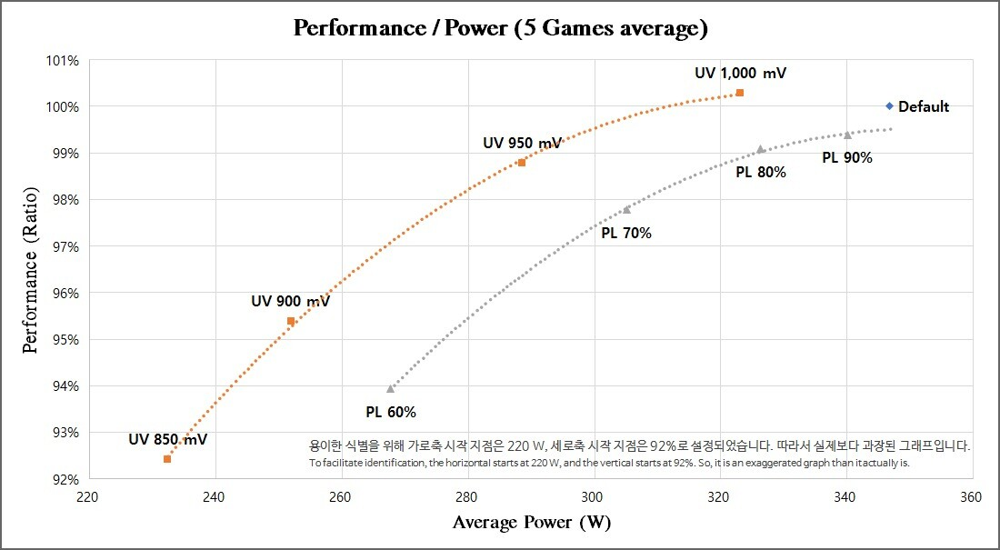

# RigSetup-Pop!_OS

This is my Pop!_OS installation process for the rig I built. Hope this guide is useful!

[My build](https://pcpartpicker.com/list/jGW6Fs)

## Pop!_OS installation

Followed the usual [guide for Pop!_OS](https://support.system76.com/articles/install-pop/)

I used [ventoy](https://www.ventoy.net/en/index.html) for the iso installation.

I am on an Asus motherboard and first thing I had to do was set "OS Type" to "Other OS", thus turning off "Secure Boot Mode". This is needed whenever installing any Linux OS, per the [ASUS documentation](https://www.asus.com/us/support/faq/1049829/).

I then noticed that I couldn't get Pop!OS to to start installing. The initial window for Pop!_OS would open and countdown timer would decrement, but error out afterward. I noticed some time later that "Secure Boot Mode" was set to "Custom" and figured that it might still might not be disabled. So after reading some online blogs I seen people say set your "Boot Device Control" to Legacy. After doing this the Pop!_OS installation started running!

From here Pop!_OS worked perfect out of the box!

## Setup AIO

Kraken AIO doesn't allow you to interact with it on Linux platforms. So I followed the guide for [liquidclt](https://github.com/liquidctl/liquidctl)

Following the guide it says you can install liquidctl using Pip. The issue with this is that Kraken AIO isn't supported by the available Pip install versions of liquidctl. So you need to manually install liquidctl from the github repository itself(cloning the repository). This process could be followed by the section "Manual Installation" on the github repository. 

Following the guide I created a conda environment specifically for using liquidctl(better to not use system python). I cloned the repository, pip installed the dependencies, ran pytest from the repository to test if everything works, and then installed liquidctl into the environment.

From here I used the command line interface for liquidctl and everything seemed to be working! 

## Automation

I wanted to automate the AIO settings and Nvidia GPU settings on startup. So the following gives my guide for how I went about it.

### Liquidctl

I followed the guide under the section "Automation and running at boot" from the liquidctl repository. Folowing the guide was helpful and it works, but I noticed that some extra things was needed for automation.

First I needed to create a way for the "/etc/systemd/system/liquidcfg.service" file to wait for my Kraken device upon bootup. So the guide has a special guide for "Making systemd units wait for device". I followed this guide making the custom rules file and tried a few different settings, but wasn't quite able to get things to work. 

In the second portion of the guide I seen that the new device units was being added as dependencies to the service unit(displayed in the guide). From some random online blogs I seen someone use kraken.device without creating a custom rule... so I tried it. I created the file "/etc/systemd/system/liquidcfg.service" and added the following code:

```
[Unit]
Description=AIO startup service
Wants=kraken.device
After=kraken.device

[Service]
Type=oneshot

ExecStart=/usr/bin/bash -c 'source <path-to-python-environment>/liquidctlEnv/bin/activate && liquidctl --match kraken initialize && liquidctl --match kraken set pump speed 20 30 30 50 34 80 40 90 50 100 && liquidctl --match kraken set fan speed  20 30 30 50 34 80 40 90 50 100 && liquidctl --match kraken set lcd screen static <path-to-images>/images/img.jpeg && liquidctl status --verbose'

[Install]
WantedBy=default.target
```

**Note:** That \<path-to-\> means insert path.

Behold this ended up working! I tried looking up the devices and show evidence that "kraken" was linking to the AIO device, but couldn't find anything to prove it. It worked so I just moved on haha apologies. 

The actual AIO settings used above is just from the [guide for "Fourth-generation NZXT liquid coolers"](https://github.com/liquidctl/liquidctl/blob/main/docs/kraken-x3-z3-guide.md). I also added the command for adding an image on the LCD screen just as indicator to myself that it works on boot up.


### Nvidia GPU 

Here I was interested in limiting the power limit on my GPU. This is because of this [article](https://www.techpowerup.com/301649/nvidia-geforce-rtx-4090-with-nearly-half-its-power-limit-and-undervolting-loses-just-8-performance) displayed the following plot:



I decided to just want to place a power limit of 300 on my GPU. I figured anything more wouldn't really be that valuable. So following the [guide](https://linuxconfig.org/how-to-set-nvidia-power-limit-on-ubuntu) I created the file "/etc/systemd/system/nvidia-power-limit.service" and added the following code:

```
[Unit]
Description=Set NVIDIA GPU Power Limit

[Service]
Type=oneshot
ExecStart=/usr/bin/nvidia-smi -pl 300

[Install]
WantedBy=multi-user.target
```

This ended up working and you can verify it yourself doing the following command:

```
nvidia-smi -q -d POWER
```